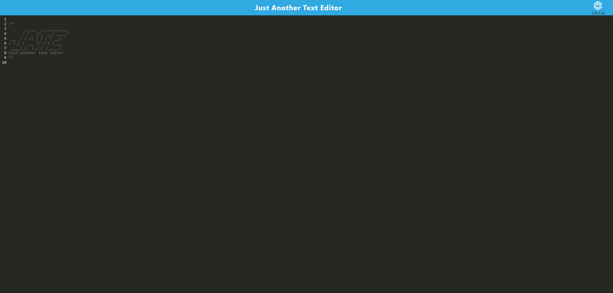

# Just-Another-Text-Editor

## Description

A simple text editor PWA built with webpack, indexedDB, and express.js. Allows you to install it locally and works even when offline.

## Installation

1. Clone the repository
1. run `npm install` in your terminal.
1. After all packages are installed, run `npm run start` in your terminal.
1. Navigate to https://localhost:3000
1. Start editting text in the editor! You can click the install button to install it locally.

## Usage

A simple text editor that lets you add text. It uses indexedDB to store the text locally so you can access it even offline. To start change the text in the editor, it will automatically save when you unfocus the the text editor. Refresh the page or come back at anytime to see your text is saved!.

[Live Demo](https://just-another-text-editor-pwa.onrender.com/)

## Screenshot

## License

N/A
